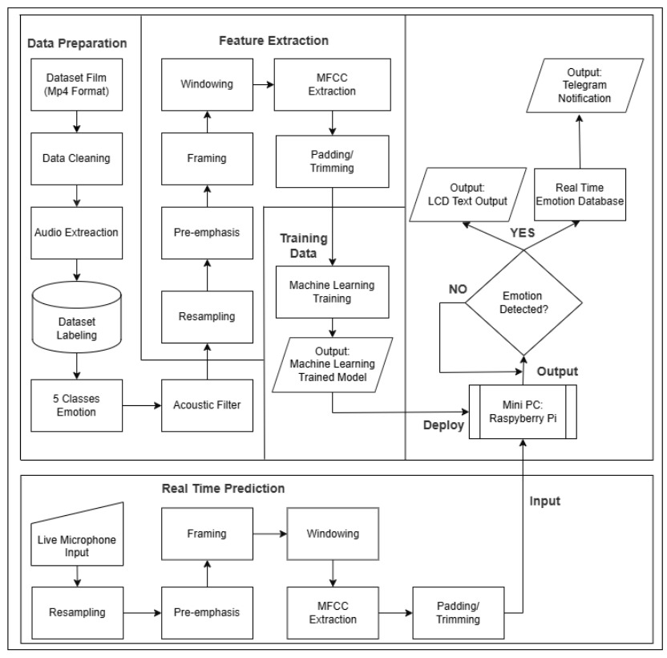
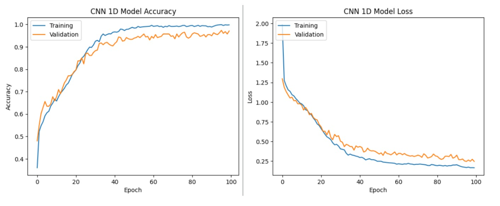
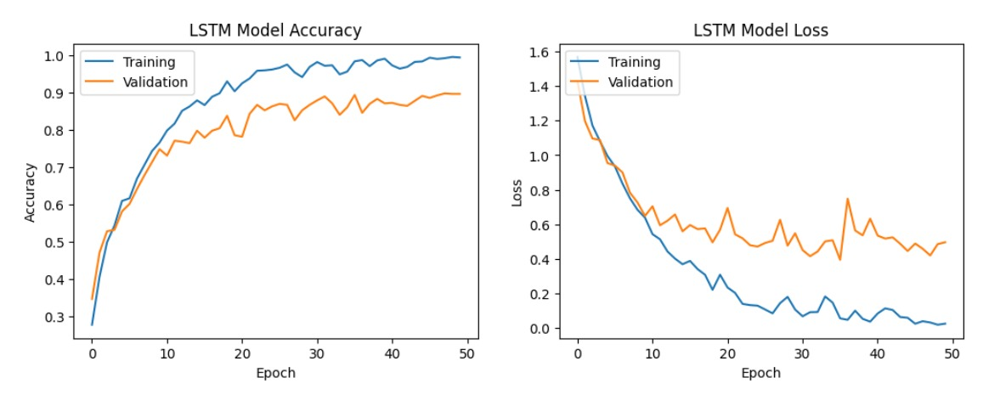

# 🗣️ Speech Emotion Recognition (SER) Pipeline

An end-to-end machine learning pipeline built to process raw video and audio data into a standardized dataset, extract acoustic features, and train deep learning models for Speech Emotion Recognition (SER).

This project encompasses the entire data lifecycle: from automated video trimming and dataset annotation preparation to acoustic filtering and deep learning training using 1D CNN and LSTM architectures.

---

## 🧠 Overview

The system automates the tedious process of preparing raw multimedia data for machine learning. It utilizes AI-based transcription to trim clips, prepares evaluation forms for human annotators, calculates annotation reliability, and finally extracts acoustic features to train emotion classification models.

**Why an automated pipeline?**
Building a robust SER dataset requires precise temporal clipping and standardized labeling. By leveraging Whisper AI for automatic transcription and timestamp extraction, this pipeline eliminates manual audio slicing. It also seamlessly integrates human-in-the-loop validation (via Google Forms and Fleiss' Kappa analysis) before feeding the cleaned acoustic features into neural networks.

### System Architecture & Pipeline Flow


> *Comprehensive system flowchart illustrating the end-to-end process from raw film dataset preparation, acoustic filtering, feature extraction, model training, up to real-time deployment on Raspberry Pi.*

---

## ✨ Features & Pipeline Steps

- **STEP 1: Automated Trimming** — Extracts precise audio/video clips using pre-existing SRT files or automatic transcription and segmentation via Whisper AI.
- **STEP 2: Form Preparation** — Organizes the clipped data and generates the necessary metadata structure for annotator evaluation.
- **STEP 3: Google Forms Automation** — A Google Apps Script (`.js`) to automatically generate annotation forms, saving hours of manual data entry.
- **STEP 4: Annotator Agreement (Fleiss' Kappa)** — Statistically evaluates the reliability and consistency of human emotion labels using Fleiss' Kappa analysis.
- **STEP 5: Acoustic Filtering & Feature Extraction** — Cleans the audio signals and extracts vital acoustic features (e.g., MFCCs) required for model training.
- **Deep Learning Models** — Includes complete training and evaluation pipelines for both **1D Convolutional Neural Networks (1D CNN)** and **Long Short-Term Memory (LSTM)** networks.

---

## 📈 Model Training Results & Evaluation

### 1. 1D Convolutional Neural Network (1D-CNN)


> **Training Result:** The 1D-CNN model achieved an outstanding validation accuracy of **94.13%** (with a macro F1-Score of 0.9413), demonstrating stable convergence and excellent generalization across feature representations.

### 2. Long Short-Term Memory (LSTM)


> **Training Result:** The Bidirectional LSTM model achieved a validation accuracy of **89.60%** (with a macro F1-Score of 0.8956), capturing temporal sequence dynamics while showing slight relative variance compared to the CNN architecture.

---

## 🛠️ Tech Stack

| Layer | Technology |
|---|---|
| Environment | Jupyter Notebook / Google Colab |
| Data Processing | Python, Pandas, NumPy |
| Audio/Video Processing | MoviePy, Librosa, FFmpeg, Whisper AI |
| Form Automation | Google Apps Script (JavaScript) |
| Statistical Analysis | Statsmodels, NLTK (for Fleiss' Kappa) |
| Deep Learning | TensorFlow / Keras |

---

## 📁 Project Structure

```text
.
├── LICENSE
├── README.md
├── Projectdiagram.jpeg          # System architecture and pipeline flowchart
├── 94CNNResult.jpeg             # Training accuracy and loss curves for 1D-CNN (94.13%)
├── 89LSTMResult.jpeg            # Training accuracy and loss curves for LSTM (89.60%)
├── STEP1_TrimmingMovie.ipynb      # Whisper & SRT-based clipping
├── STEP2_FormPreparation.ipynb    # Metadata prep for annotators
├── STEP3_GformMaker.js            # Apps Script to generate Google Forms
├── STEP4_FKanalysis.ipynb         # Fleiss' Kappa calculation
├── STEP5_AcousticFilter.ipynb     # Audio feature extraction
├── Training1_1DCNN.ipynb          # 1D CNN Model Training
└── Training2_LSTM.ipynb           # LSTM Model Training
```

---

## 🚀 Getting Started

### Prerequisites
- Python 3.8+
- Jupyter Notebook or Google Colab
- System dependencies: `ffmpeg`

### Installation

1. Clone the repository:
   ```bash
   git clone [https://github.com/ramailham23/ser-data-preparation.git](https://github.com/ramailham23/ser-data-preparation.git)
   cd ser-data-preparation
   ```
2. Install the required Python libraries:
   ```bash
   pip install moviepy whisper pysrt librosa pandas numpy tensorflow
   ```

### Execution Order

To reproduce the workflow, execute the files in sequential order:

1. **`STEP1_TrimmingMovie.ipynb`**: Provide your raw `.mp4` or `.wav` files and let Whisper/SRT cut them into bite-sized dataset clips.
2. **`STEP2_FormPreparation.ipynb`**: Run this to generate the CSV/metadata required for the next step.
3. **`STEP3_GformMaker.js`**: Copy this script into a Google Apps Script project to automatically create your dataset labeling forms.
4. **`STEP4_FKanalysis.ipynb`**: Export your form responses and run this notebook to filter out unreliable labels.
5. **`STEP5_AcousticFilter.ipynb`**: Extract ML-ready features from the validated clips.
6. **`Training1_1DCNN.ipynb`** or **`Training2_LSTM.ipynb`**: Train your models on the extracted features.

---

## 📝 Notes & Limitations

- The automated trimming in Step 1 depends heavily on the clarity of the audio for Whisper AI to generate accurate timestamps. Extremely noisy backgrounds might require manual threshold adjustments.
- The Google Apps Script (`STEP3_GformMaker.js`) requires Google Drive/Forms API permissions to run successfully on your Google Workspace account.

---

## 📚 What I Learned

Building this pipeline demonstrated the complexities of dealing with raw, unstructured multimedia data:
- How to orchestrate multiple tools (Whisper, FFmpeg, MoviePy) to manipulate audio/video programmatically.
- The importance of **human-in-the-loop validation**; utilizing Fleiss' Kappa ensures that the emotion labels fed into the model are statistically reliable, rather than subjective guesses.
- Designing acoustic feature extraction pipelines that bridge the gap between raw waveforms and deep learning architectures (CNNs and LSTMs).

---

## 📄 License

This project is open source under the [MIT License](LICENSE).

---

## 👤 Author

**Moh. Ilham Ramadan (Rama)** 
*Telecommunication Engineering, Politeknik Elektronika Negeri Surabaya (PENS)* 
Embedded Systems, IoT & Machine Learning Enthusiast

- GitHub: [@ramailham23](https://github.com/ramailham23)
